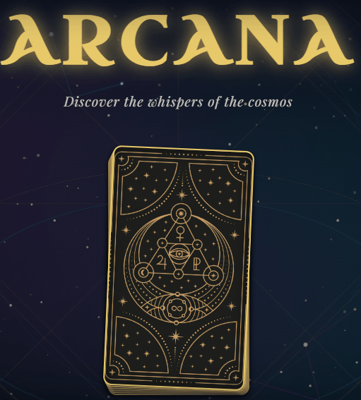

# 🌙 Arcana — Interactive Tarot Card Reader


> A fully interactive, state-managed React SPA featuring a 78-card tarot deck, procedural Canvas rendering, and a responsive celestial UI.

---

## 🎬 Live Preview



**[Live Demo](https://cosmic-whispers.netlify.app/)**

---

## ✨ Features

- **🔮 Stunning Mystic Design**: Sleek dark-mode theme accented with curated gradient highlights, custom gold-foil frames, runic typography, and a shifting cosmic nebula.
- **🌌 Dynamic Star Background**: A canvas-based interactive background rendering a drifting, glowing field of stars that breathes life into the screen.
- **✨ Cosmic Particle Cursor Trail**: Mouse interactions leave a trail of fading mystic particles that react to your movements.
- **🃏 Interactive Shuffling & Drawing**: Complete tarot card interaction with realistic shuffling animations, fluid card drawing, and beautiful flipping effects.
- **📖 Comprehensive Interpretations**: Integrates a rich database of Major and Minor Arcana cards with descriptive meanings for both upright and reversed positions.
- **📱 Responsive Layout**: Seamless experience tailored for all screen sizes, from high-resolution desktop displays to mobile screens.

---

## ⚙️ Architecture & Technical Logic

- **State Management**: Implemented a finite state machine (`home → shuffling → reading → revealed`) to manage multi-phase user flows across deck, card spread, and detail panel components.
- **Procedural Graphics**: Engineered real-time visual effects—including a proximity-reactive 300-star parallax background and particle-emitting cursor trails—using pure HTML5 Canvas `requestAnimationFrame` loops.
- **Modern UI/UX**: Designed a responsive, dark-themed design system featuring CSS variables, fluid `clamp()` typography, glassmorphism panels, and 3D card-flip transforms.
- **Data Pipeline**: Integrated a custom Python data pipeline to fetch and structure Rider-Waite-Smith artwork and descriptive metadata into a localized JSON dataset.

---

## 🛠️ Technology Stack

- **Framework**: [React](https://react.dev/) + [Vite](https://vite.dev/) (Ultra-fast development server and building)
- **Styling**: Pure Vanilla CSS (custom-tailored HSL colors, responsive grid/flexbox layouts, custom animations)
- **Effects**: HTML5 Canvas (for high-performance particle animations)
- **Data**: JSON-based Tarot Arcana deck (`tarot.json`)

---

## 🚀 Local Installation

1. Clone the repository:
   ```bash
   git clone https://github.com/Nova-2705/arcana-tarot-app.git
   ```
2. Install dependencies:
   ```bash
   npm install
   ```
3. Start the development server:
   ```bash
   npm run dev
   ```
